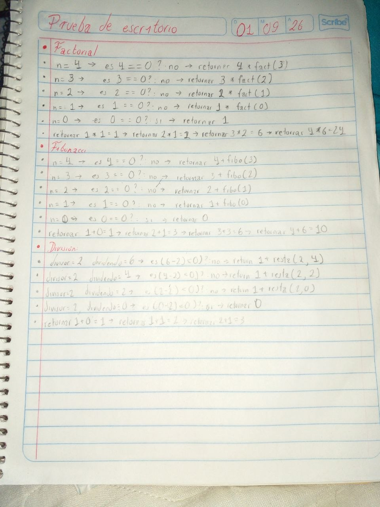

# Factorial, Fibonacci y Divisiones

## **Fecha**: 09/01/26

## **Descripción**: 
Crear un programa usando recursividad para realizar las siguientes funciones: *Factorial de un número*, *Serie de Fibonacci hasta n término* y *División mediante restas*.

## Descripción del código

### Método `factorialRecursivo`

Esté método recibe el parámetro *n* que indica el número que se le sacará su factorial, el cual por definición es: la multiplicación del número con los números naturales anteriores a este.

```java
public int factorialRecursivo(int n) {  
    // CASO BASE, AL ENTRAR RETORNA 1 Y SE EMPIEZA A REGRESAR A LAS ANTERIORES LLAMADAS DE LA FUNCIÓN.
    if (n == 0) return 1;  
    // SI NO ENTRA AL CASO BASE, N SE MULTIPLICA POR EL RESULTADO DE LLAMAR A LA MISMA FUNCIÓN DE N-1
    return n * factorialRecursivo(n-1);  
}
```

### Método `fibonacciRecursivo`

Esté método recibe el parámetro *n* que indica hasta donde se realizará la sucesión de Fibonacci, el cual por definición es: la suma de un número natural con el o los números naturales previos a este.

```java
public int fibonacciRecursivo(int n) {
	// CASO BASE, AL ENTRAR RETORNA 0 Y SE EMPIEZA A REGRESAR A LAS ANTERIORES LLAMADAS DE LA FUNCIÓN.
    if (n == 0) return 0;   
    // SI NO ENTRA AL CASO BASE, N SE SUMA POR EL RESULTADO DE LLAMAR A LA MISMA FUNCIÓN DE N-1
    return n + fibonacciRecursivo(n-1);  
}
```

### Método `divisionRestasRecursivo`

A diferencia de los anteriores se reciben dos parámetros: *divisor* y *dividendo*. Si la resta del *dividendo* por el *divisor* no es menor a 0, entonces se suma 1 al llamado de la función donde el *divisor* permanece igual pero el *dividendo* se le resta por el *divisor*. Si al contrario es menor a 0 se retorna 0.

```java
public int divisionRestasRecursivo(int divisor, int dividendo) {  
    // CASO BASE
    if ((dividendo -  divisor) < 0 ) return 0;  
    // RECURSIVIDAD
    return 1 + divisionRestasRecursivo(divisor, dividendo-divisor);  
}
```

## Prueba de escritorio

