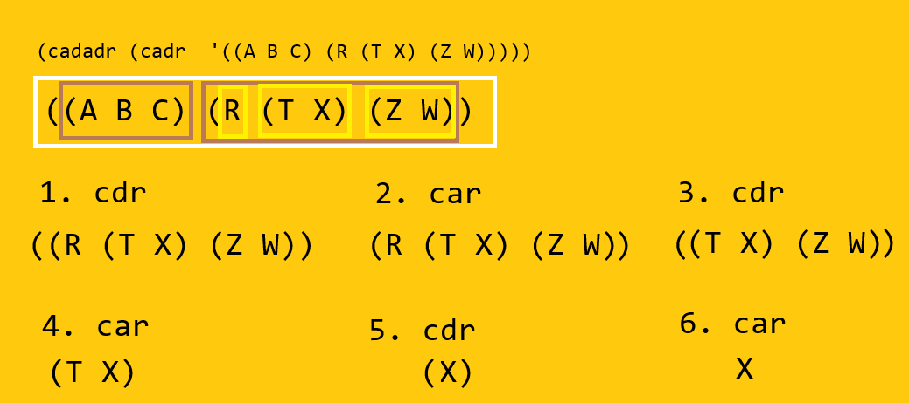

# CAD y CDR

## **Fecha**: 09/09/26

## **Descripción**

Realizar los siguientes ejercicios

```commonlisp
; a) (1 2 3 4 5 6 7 8 9 10) -> (6 , 8, 10)
; b) (1 2 (3 4) (A B C D)) -> (D, C, 4, 2 ,A)
; c) ((A B C) (R(T X) (Z W))) -> (W, Z, T, R, X, A)
; d) ((((a b) (c d) (f y)))) -> (a b c d f y)
```

`CAD` y `CDR` son las funciones más básicas en Common Lisp.

- `cad`: Entrega el primer elemento de una lista
- `cdr`: Entrega la cola de la lista (quita la cabeza y entrega el resto)

